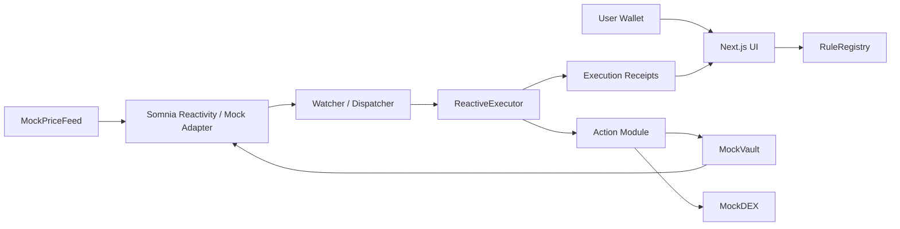

# Architecture

ROP packages a protocol, a watcher, and a live UI around Somnia’s event-driven execution model.

## Diagram

## Core Components

### RuleRegistry

Stores canonical rules:

- trigger spec
- condition spec
- action spec
- limits
- metadata

It also tracks last execution time and daily execution counts.

### ReactiveExecutor

The executor is the protocol guardrail layer. It does not decide *whether* a rule should match; it enforces whether the rule is still allowed to fire:

- rule must be active
- cooldown must be clear
- daily execution cap must not be exhausted

### Watcher

The watcher is the MVP relay:

- receives Somnia Reactivity callbacks
- normalizes event payloads
- suppresses duplicate event keys
- loads rules from the registry
- evaluates trigger and threshold logic
- dispatches on-chain execution
- streams receipts over SSE

### Action Modules

Action modules keep execution pluggable:

- `ActionWithdrawFromVault`
- `ActionSwapToStable`
- `ActionEmitOnly`

That keeps the protocol generic while the demo stays narrow and understandable.

## Happy Path

1. User creates Guardian rules in the UI
2. A `PriceUpdated` or `HealthFactorChanged` event occurs
3. The watcher receives the callback
4. Matching rules are evaluated
5. The watcher sends `fire(ruleId, triggerPayload)` to `ReactiveExecutor`
6. The executor records the execution and calls the action module
7. `RuleFired` is emitted and surfaced in the UI

## Trust Assumptions

- The watcher is trusted in the MVP
- The mock DeFi contracts are demo-only
- Action modules are deployed and known ahead of time
- Off-chain duplicate suppression is good enough for hackathon scope

## Extensibility Path

The current repo is intentionally ready for:

- more trigger kinds
- more condition operators
- protocol-authored template packs
- decentralized execution
- richer state bundles via Somnia Reactivity `ethCalls`
